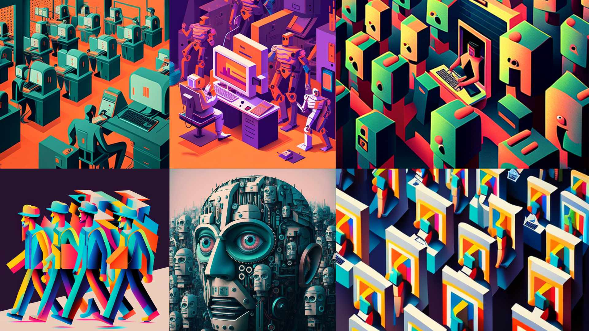

```
👋🏼 Hi,

I am Equan P. from Indonesia.
I build software and web applications.
I 💖 AI, programming & hardware design.

```

**✨ For Business**

[🔘 Hire Me 👉 Upwork](https://www.upwork.com/freelancers/equan)

<br/>

**👨🏼‍💻 Tech Stacks**

| Year            | Techs            |
|-----------------|-----------------:|
| 2007 - 2009     | Assembly AT89C51 |
| 2010 - 2012     | Java, Coldfusion, PHP, ActionScript 3 |
| 2012 - Present  | JavaScript, Node.js, React.js, Express.js, MongoDB, MySQL |
| 2016 - 2019     | C#, Unity |
| 2021 - Present  | TypeScript, Rust, Amazon Web Services |
| 2022 - Present  | STM32 Microcontrollers (STM32F4, STM32F7) |
| 2023 - Present  | Python, Machine Learning, AI, OpenAI |

<br/>

**🚀 Projects**

[The AI Enthusiast](https://junwatu.com)

Insights about the latest AI developments, and technical development guides for creating Generative AI apps. This site is the go-to destination for AI enthusiasts at all levels of expertise.

[Articard](https://github.com/junwatu/articard)

**Articard** is an art history card web application.

> This app build with MERN stack, Redis as cache and Microservices in mind.

[Pustaka Kalender Jawa](https://github.com/kalenderjawa)

**Pustaka** is a JavaScript library for the Javanese Calendar. 

> Javanese calendar is a moon-based calendar system. Javanese using it for many purposes in daily life till these days since the 14th century.

<br/>

**📚 Books**

[Pengenalan Node.js: Melalui Web Aplikasi](https://play.google.com/store/books/details?id=pdOfDwAAQBAJ)

It's a beginner-friendly book about JavaScript programming in Node.js [Bahasa Indonesia].

